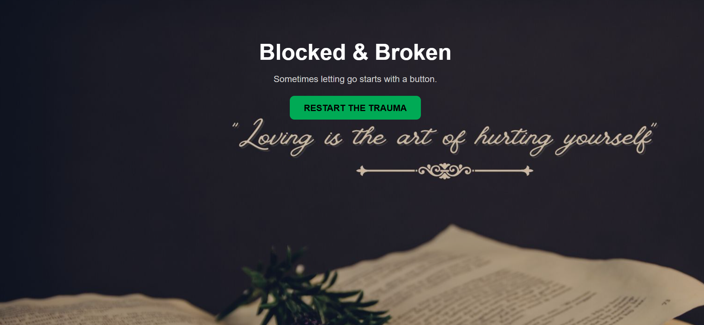
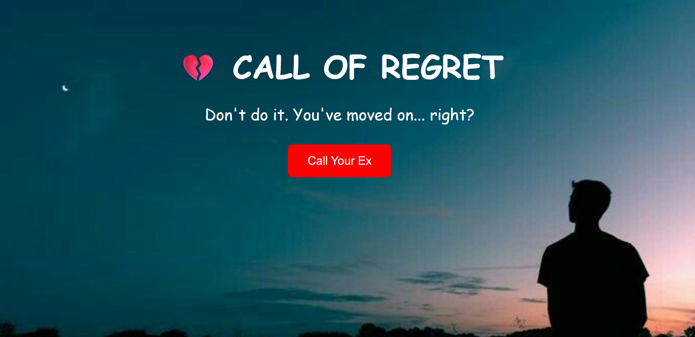
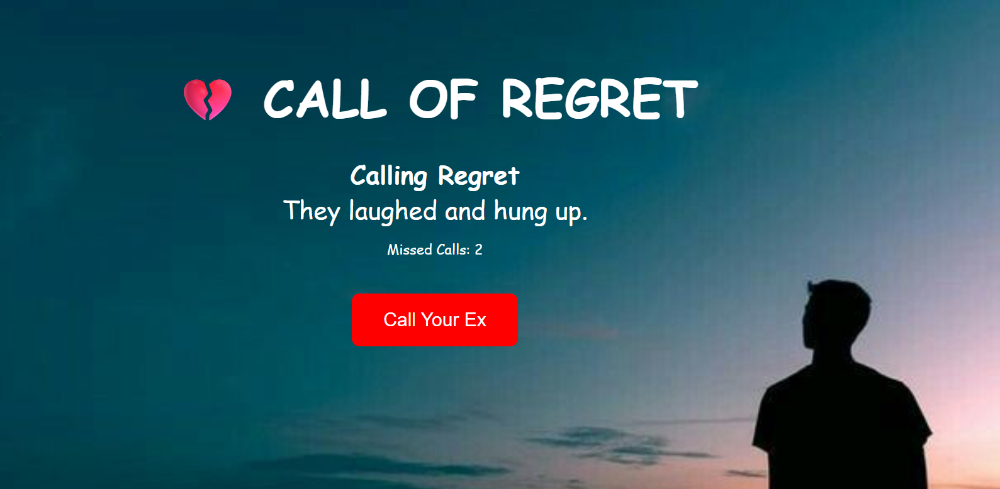

# Broken & Blocked 🎯

## Basic Details
### Team Name: Tofeechu

### Team Members
- Team Lead: Aryananda SM - LBSITW
- Member 2: Navya J - LBSITW

### Project Description
ChatGPT said:
Blocked & Broken: Call of Regret is a satirical web project that simulates the emotional chaos of calling your ex — complete with fake calls, mocking messages, and a downloadable Certificate of Emotional Damage. Built for a “Useless Hackathon,” it’s a playful take on heartbreak, regret, and healing.

### The Problem (that doesn't exist)
ChatGPT said:
This project hilariously "solves" the problem of post-breakup impulsiveness — that urge to call your ex at 2AM when you really shouldn’t. It acts as a digital emotional punching bag, letting users spiral safely through rejection without ruining their dignity in real life.

### The Solution (that nobody asked for)
A fake ex-calling simulator that lets you relive the pain, get mocked by sad messages, hear a voicemail of regret, and finally "call yourself" for closure — all ending with a downloadable Certificate of Emotional Damage. Because sometimes, healing needs a bit of humor and a lot of nonsense.
## Technical Details
### Technologies/Components Used
**🛠️ Technologies & Components Used:**

* **HTML, CSS, JavaScript** – Core web development
* **Canvas API** – For generating the Certificate of Regret
* **Web Audio & Video APIs** – Ringtone, voicemail, and webcam access
* **Teachable Machine + TensorFlow\.js** – (Optional) Face detection or emotional response
* **Glitch effects & animations** – For that extra dose of chaos and drama
* **Creative energy** – 90% pain, 10% code 😅

### Implementation
For Software:git clone https://github.com/navya-pavanan/blocked-and-broken.git
cd blocked-and-broken

# Installation
git clone https://github.com/navya-pavanan/blocked-and-broken.git

# Run
open index.html

### Project Documentation
For Software:

# Screenshots (Add at least 3)

### Project Demo
# Video
<video controls src="Blocked & Broken - Google Chrome 2025-08-02 06-44-11.mp4" title="Title"></video>
The video showcases the user experience of interacting with the “Call Your Ex” simulator. It begins with repeated fake call attempts that trigger a variety of humorous and painful rejection messages. After several tries, the call is “blocked,” and a voicemail audio plays — a final message of emotional doom.

Following this, the user is prompted to “Call Yourself”, activating the webcam (video element) to simulate self-reflection. Finally, the system generates and displays a Certificate of Emotional Damage, which the user can download as proof of their poor life decisions. Both ringtone and voicemail audio files enhance the drama and satire throughout the journey.

---
Made with ❤️ at TinkerHub Useless Projects 

